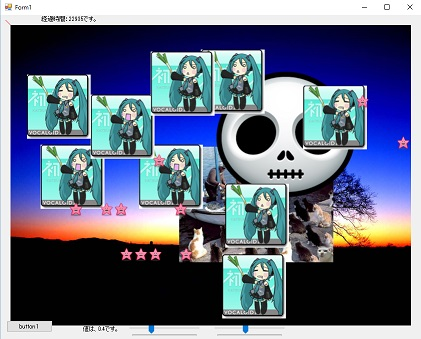
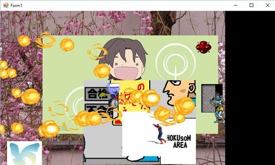
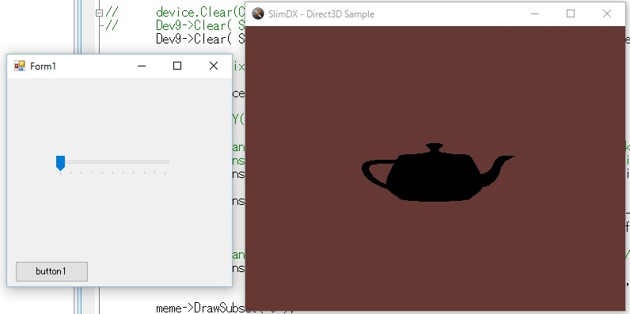
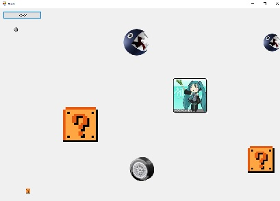
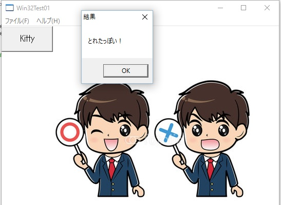

# work_VisualCpp
Visual C++ を使った、実験プログラム集です。（※現在整理中です。少しづつアップして増やしていってます。）  

# サンプル紹介
**Sankaku01**  
Windows上で画像を展開し、複数の画像を同時にsin/cosで計算した角度で動かして壁際で反射させるデモです。  
画面表示は「Double Buffer」を使用し、効果音は「Slim DX」を使用しています。  
  

**AniGifTest01**  
Gifアニメ画像をアニメーションさせるデモです。  
沢山のGifアニメがそれぞれアニメします。  
マウスオンでヨガの人が動き、マウスクリックでファイアーを乱射します。  
  

**SlimDXTest**  
SlimDX-Direct3Dサンプルです。  
魔法のランプ的なシルエットがクルクル回ります。  
  

**StlTest02**  
マウスオーバーの中心にが画像が配置されるサンプルです。  
一応ゲームっぽく左から敵が押し寄せてくるので、避けて遊んでみて下さい。  
  

**Win32Test**  
Win32API（非フレームワーク）でのWindow起動サンプルです。  
ただ、Windowが開くだけですが、Win32APIに必要な（煩雑な）手続きを入れています。  

**Win32Test01**  
Win32API(非フレームワーク)でのWindows起動サンプル２です。  
Window上にビットマップを展開表示し、モーダルダイアログを表示しています。  
  

(2016/09)
